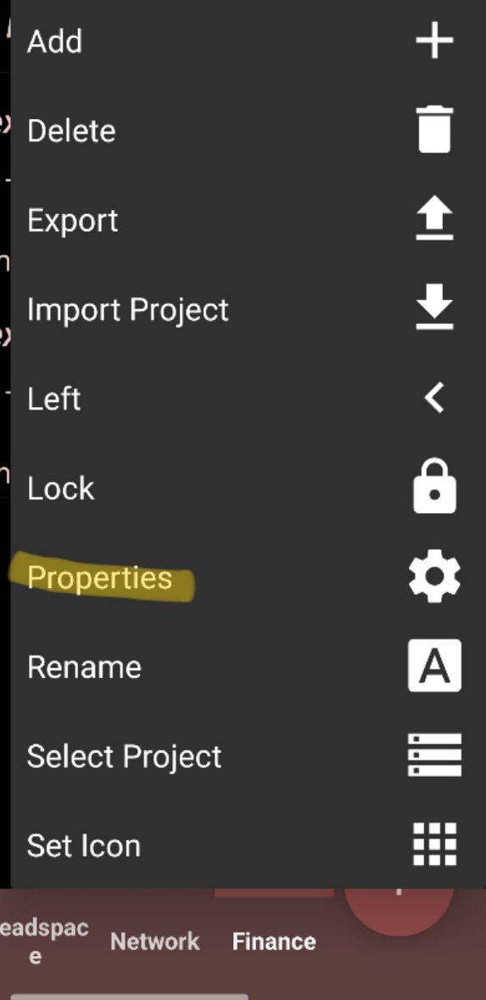
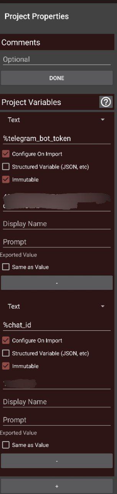
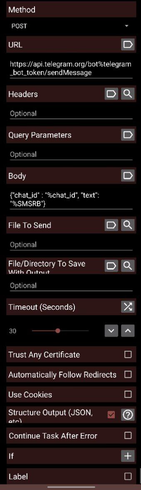
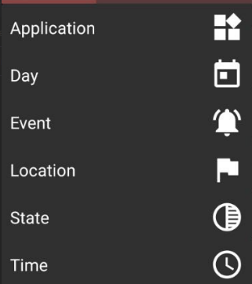
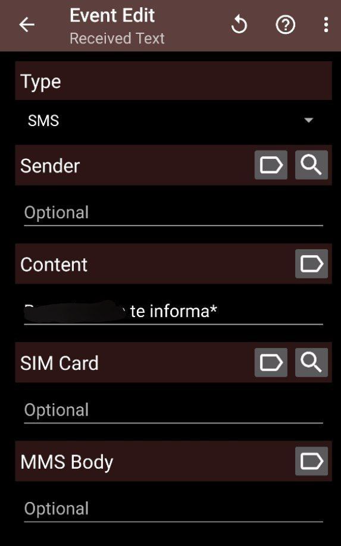

# Forwarding SMS to Telegram using Tasker

Telegram released a feature that allows you to tag *Saved Messages* with emojis, making it easier to filter them later. This feature has been very helpful for me in tracking expenses and even managing my dog's health. I started saving every expense in Telegram and would occasionally transfer them to my main accounting app. This system worked fine for a while, but I realized that most of my saved expenses were from my main Savings Account or Credit Card linked to the same bank. That’s when I thought I could save time by automating the process.

Since my bank sends an SMS notification for every transaction I make, I figured I could automate this using Tasker.

My bank doesn’t provide another method to receive these notifications, so SMS was the only way to get this information in real time.
## Tasker Project
First, create a new Tasker project to store variables, profiles, and tasks. I named mine `Finance`. Then, go to the project properties, where you can set these properties by holding the name of the project:
.
Add two project variables: `telegram_bot_token` and `chat_id`. These will hold your bot token and the chat ID of the specific conversation where you want to receive updates.

## Create a Task
Create a new `Task` and add an action of type `HTTP Request`. Then, fill in the parameters for the action as follows:
| Param | Value |
|-------|-------|
| Method| POST  |
| URL | https://api.telegram.org/bot%25telegram_bot_token/sendMessage |
| Body | `{"chat_id" : "%chat_id", "text": "%SMSRB"}` |

Here, you can see the variables being updated at the time of sending the Telegram message. The varible `%SMSRB` is the body of an SMS Text Message.

## Create Profile
Now, create a profile to trigger the task and complete the automation. Start by adding a profile as an *Event*:

Search for the event  `Received Text` which will trigger the action on a specific SMS message. The  `Content`  parameter to match the text using regular expressions. In this case, my bank always sends transaction information after a specific phrase that includes the bank’s name:

I had to add multiple events, as my bank randomizes the SMS content slightly.
## Telegram Bot
Now, you should receive the messages in Telegram, which can be forwarded and labeled for convenient use.
